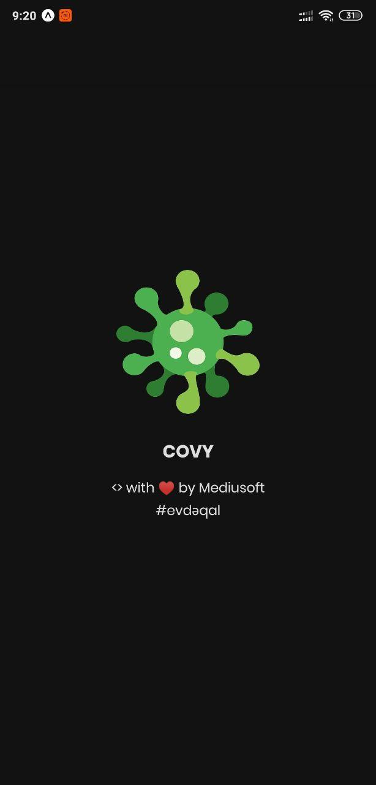

# Covid19 Tracker
_Found it useful? Want more updates?_

[**Show your support by giving a :star:**](https://github.com/mediusoft/covid-19-tracker-react-native/stargazers)

 

> ✨ **Note:** This library is based on [Covid19-Tracker](https://github.com/rbayuokt/Covid19-Tracker-ReactNative) with more features and cooler designs and thansk to [@mathroid](https://github.com/mathdroid/covid-19-api) for API. I’m happy to consider suggestions, pull requests and bug reports.

 

# Tools
- [x] React Native

# Features
- [x] Pull To Refresh
- [x] Auto detect country
- [x] Multilanguage support
- [x] Other features are comming...

# Used Libraries
- [x] React Native Dropdown [link](https://www.npmjs.com/package/react-native-material-dropdown)
- [x] WHC Loading [link](https://github.com/netyouli/react-native-whc-loading)
- [x] Pull To Refresh
- [x] i18Next
- [x] Expo-location
- [x] OpenCage Geocoder [link](https://opencagedata.com/)
- [x] Axios

# Screenshoot 

**Splash Screen :**  
 

**Home Screen Updated to v 1.2**  
 

**Result Screen :**  
 

**Error Screen :**  
 
